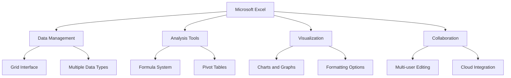
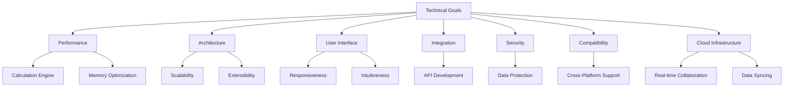
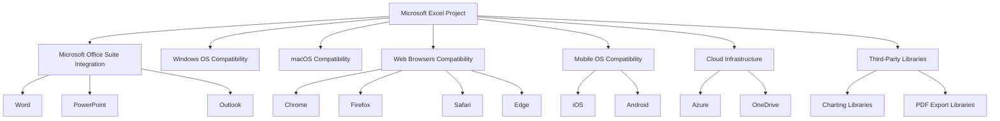
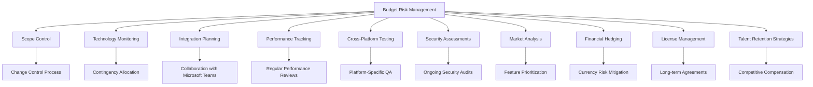
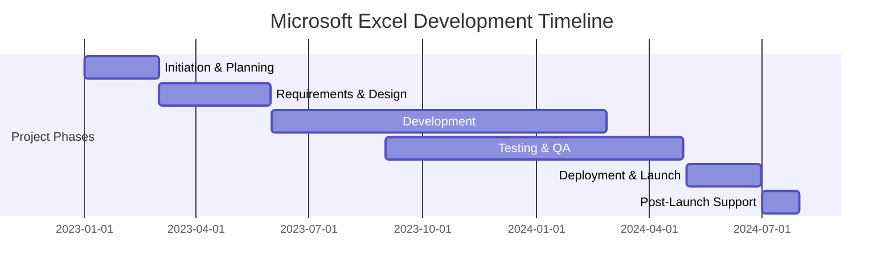
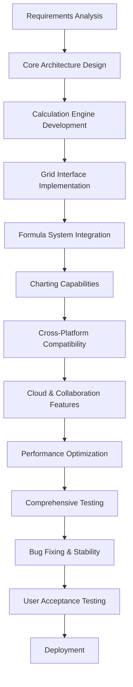
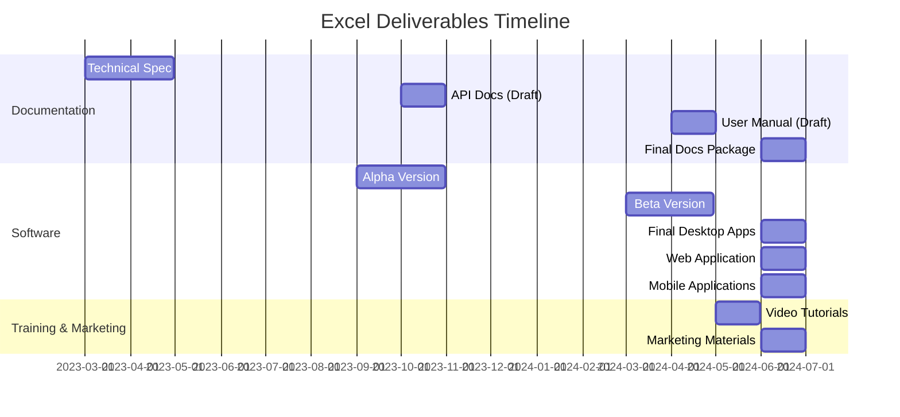

# EXECUTIVE SUMMARY

## PROJECT OVERVIEW

Microsoft Excel is a revolutionary spreadsheet software application designed to transform the way individuals and businesses organize, analyze, and visualize data. In response to the growing need for powerful yet user-friendly data management tools, Excel offers a comprehensive solution that combines intuitive design with advanced functionality. The software addresses the client's need for efficient data handling, complex calculations, and insightful data representation, all within a single, integrated platform.

## OBJECTIVES

1. Develop a robust, grid-based interface for seamless data input and manipulation
2. Implement a comprehensive formula system supporting complex calculations and data analysis
3. Create advanced charting and graphing capabilities for effective data visualization
4. Design an intuitive, ribbon-style toolbar to enhance user experience for both beginners and power users
5. Ensure cross-platform compatibility (Windows, macOS, web, and mobile)
6. Integrate cloud storage and syncing for seamless access across devices
7. Implement collaboration features to support multiple users working simultaneously

## VALUE PROPOSITION

Our agency offers unparalleled expertise in developing sophisticated software solutions that balance power with accessibility. For Microsoft Excel, we bring:

1. Deep understanding of user needs across various proficiency levels
2. Expertise in creating scalable, high-performance applications capable of handling large datasets
3. Experience in developing cross-platform solutions with seamless integration
4. Strong focus on user interface design, ensuring intuitive navigation and feature discovery
5. Proven track record in implementing robust calculation engines and data analysis tools
6. Commitment to ongoing support and feature enhancement based on user feedback and evolving market needs

## PROJECT OBJECTIVES

### BUSINESS GOALS

1. Establish Microsoft Excel as the industry-leading spreadsheet application
2. Increase market share in the productivity software sector
3. Enhance user productivity and efficiency across various industries
4. Drive adoption of the Microsoft Office suite through Excel's integration
5. Generate recurring revenue through subscription-based licensing models
6. Expand the user base by catering to both novice and advanced users
7. Foster a robust ecosystem of third-party add-ins and integrations

### TECHNICAL GOALS

1. Develop a high-performance calculation engine capable of handling large datasets
2. Implement a scalable and extensible architecture to support future feature additions
3. Create a responsive and intuitive user interface across all supported platforms
4. Optimize memory usage and processing efficiency for improved performance
5. Develop a comprehensive API for seamless integration with other applications
6. Implement robust data security measures to protect sensitive information
7. Ensure cross-platform compatibility (Windows, macOS, web, and mobile)
8. Develop a cloud-based infrastructure for real-time collaboration and data syncing

### SUCCESS CRITERIA

| Criterion | Target | Measurement Method |
|-----------|--------|---------------------|
| Market Share | Increase by 15% within 2 years | Industry reports and sales data |
| User Adoption | 50 million active users within 1 year | User account metrics and usage statistics |
| Performance | 99.9% uptime | System monitoring tools |
| Calculation Speed | Process 1 million cells in < 5 seconds | Automated performance testing |
| User Satisfaction | 90% positive feedback | User surveys and app store ratings |
| Cross-Platform Usage | 30% of users accessing from multiple devices | User analytics data |
| Third-Party Integrations | 500 approved add-ins within 1 year | Add-in marketplace metrics |
| Data Processing Capacity | Handle workbooks up to 1GB in size | Quality assurance testing |
| Collaboration | 1 million simultaneous users | Real-time monitoring of cloud infrastructure |
| Revenue Growth | 20% year-over-year increase | Financial reports |
| Feature Utilization | 70% of features used by 50% of users | In-app usage analytics |
| Load Time | < 3 seconds on standard hardware | Automated performance testing |

These success criteria will be regularly monitored and evaluated to ensure the project is meeting its objectives and delivering value to both the business and end-users.

# SCOPE OF WORK

## IN-SCOPE

1. User Interface Development
   - Grid-based interface for data input and manipulation
   - Ribbon-style toolbar for easy access to features
   - Customizable quick access toolbar
   - Cell, row, and column formatting options
   - Multiple worksheet support within a single workbook

2. Data Management and Analysis
   - Support for various data types (numbers, text, dates, currencies)
   - Comprehensive formula system with 400+ built-in functions
   - Sorting and filtering capabilities
   - Pivot table functionality for data summarization
   - Data validation tools

3. Visualization Features
   - Charting and graphing tools with 20+ chart types
   - Conditional formatting options
   - Sparklines for in-cell mini charts

4. Advanced Functionality
   - Macro recording and VBA support for automation
   - What-if analysis tools (Goal Seek, Scenario Manager, Data Tables)
   - Solver add-in for complex optimization problems

5. Collaboration and Sharing
   - Real-time co-authoring capabilities
   - Comments and review features
   - Sharing options with granular permissions

6. Cross-Platform Development
   - Windows desktop application
   - macOS desktop application
   - Web-based version
   - Mobile applications for iOS and Android

7. Integration and Compatibility
   - Seamless integration with other Microsoft Office applications
   - Import/Export functionality for various file formats (CSV, XML, PDF)
   - API development for third-party integrations

8. Cloud Services
   - OneDrive integration for cloud storage
   - Automatic saving and version history
   - Cross-device syncing

9. Security Features
   - Workbook and worksheet protection options
   - Data encryption for sensitive information
   - Multi-factor authentication support

10. Performance Optimization
    - Large dataset handling (up to 1 million rows)
    - Multithreading support for faster calculations
    - Memory usage optimization

## OUT-OF-SCOPE

1. Advanced database functionality (beyond basic data import/export)
2. Built-in project management tools
3. Advanced statistical analysis features (beyond basic statistical functions)
4. Direct integration with non-Microsoft cloud storage services
5. Built-in machine learning or AI capabilities
6. Custom font development
7. Hardware-specific optimizations (beyond standard system requirements)
8. Integrated email client functionality
9. Built-in language translation services
10. Blockchain or cryptocurrency-related features

## ASSUMPTIONS

1. Microsoft will provide necessary access to existing codebase and documentation
2. The development team has access to required hardware and software licenses
3. Microsoft's design guidelines and coding standards will be followed
4. Adequate testing environments will be available for all supported platforms
5. Third-party libraries and components are properly licensed for commercial use
6. The project will follow an Agile development methodology
7. Regular stakeholder meetings will be held for progress updates and feedback
8. Microsoft will handle final user acceptance testing and public beta testing
9. Localization and internationalization will be handled by Microsoft's internal teams
10. Microsoft will provide necessary cloud infrastructure for online services

## DEPENDENCIES

1. Microsoft Office Suite: Integration with other Office applications
2. Operating Systems: Windows and macOS for desktop versions
3. Web Browsers: Chrome, Firefox, Safari, and Edge for web version
4. Mobile Operating Systems: iOS and Android for mobile applications
5. Cloud Infrastructure: Microsoft Azure for backend services
6. OneDrive: For cloud storage and syncing capabilities
7. Third-party Libraries: For specific functionalities (e.g., advanced charting, PDF export)
8. Microsoft Account System: For user authentication and licensing
9. App Stores: For distribution of mobile applications
10. Microsoft Update Services: For delivering software updates to desktop versions

# BUDGET AND COST ESTIMATES

## COST BREAKDOWN

The following table provides a detailed breakdown of the estimated costs for the Microsoft Excel project:

| Category | Description | Cost (USD) |
|----------|-------------|------------|
| Labor | Software Development (20 developers x 18 months) | $7,200,000 |
| Labor | UI/UX Design (5 designers x 12 months) | $900,000 |
| Labor | Project Management (2 managers x 18 months) | $540,000 |
| Labor | Quality Assurance (10 testers x 12 months) | $1,440,000 |
| Infrastructure | Cloud Services and Hosting (18 months) | $500,000 |
| Software | Development Tools and Licenses | $200,000 |
| Hardware | Development and Testing Equipment | $150,000 |
| Third-Party Services | API Integrations and Libraries | $300,000 |
| Marketing | Pre-launch Marketing and PR | $1,000,000 |
| Contingency | 10% of total budget | $1,223,000 |
| **Total** | | **$13,453,000** |

## PAYMENT SCHEDULE

The proposed payment schedule is tied to key project milestones:

| Milestone | Percentage | Amount (USD) | Due Date |
|-----------|------------|--------------|----------|
| Project Kickoff | 15% | $2,017,950 | Upon contract signing |
| Requirements Finalization | 10% | $1,345,300 | End of Month 2 |
| UI/UX Design Approval | 10% | $1,345,300 | End of Month 4 |
| Alpha Version Delivery | 20% | $2,690,600 | End of Month 8 |
| Beta Version Delivery | 20% | $2,690,600 | End of Month 14 |
| Final Version Delivery | 20% | $2,690,600 | End of Month 17 |
| Project Completion and Acceptance | 5% | $672,650 | End of Month 18 |

## BUDGET CONSIDERATIONS

Several factors could impact the budget and require careful management:

1. Scope Creep: As the project progresses, there may be requests for additional features or functionality. We will implement a strict change control process to evaluate and approve any scope changes, assessing their impact on the budget.

2. Technology Changes: Rapid advancements in technology could necessitate updates to our development approach. We have allocated a portion of the contingency budget to address potential technology shifts.

3. Integration Challenges: Unforeseen difficulties in integrating with other Microsoft Office applications or third-party services could increase development time. Our experienced team will work closely with Microsoft's internal teams to mitigate this risk.

4. Performance Optimization: Achieving the desired performance levels for large datasets may require additional optimization efforts. We have factored this into our labor estimates but will closely monitor progress.

5. Cross-Platform Development: Ensuring consistent functionality across all platforms (Windows, macOS, web, and mobile) may present unexpected challenges. Our cross-platform development experts will use best practices to minimize discrepancies.

6. Cybersecurity Measures: Evolving security threats may require additional resources to ensure robust data protection. We will regularly assess security needs and allocate resources from the contingency budget if necessary.

7. Market Changes: Shifts in the competitive landscape may require adjustments to features or marketing strategies. We will work closely with Microsoft's product management team to stay aligned with market demands.

8. Exchange Rate Fluctuations: For any international resources or services, exchange rate changes could impact costs. We will use financial instruments to hedge against significant currency fluctuations.

9. Licensing Costs: Changes in third-party licensing fees could affect our budget. We have negotiated fixed-term agreements where possible to mitigate this risk.

10. Talent Acquisition and Retention: In a competitive job market, we may face challenges in hiring or retaining key personnel. We have included competitive compensation in our labor costs to address this concern.

To manage these considerations, we will conduct regular budget reviews, maintain open communication with all stakeholders, and utilize our contingency fund strategically. Our project management team will provide monthly budget reports and forecasts to ensure transparency and enable timely decision-making if adjustments are needed.

# TIMELINE AND MILESTONES

## PROJECT TIMELINE

The development of Microsoft Excel will span 18 months, divided into the following major phases:

## KEY MILESTONES

| Milestone | Description | Target Date |
|-----------|-------------|-------------|
| M1: Project Kickoff | Initiation of the project, team assembly | 2023-01-01 |
| M2: Requirements Finalized | Completion of detailed requirements documentation | 2023-03-15 |
| M3: UI/UX Design Approved | Finalization of user interface and experience design | 2023-05-15 |
| M4: Core Engine Development | Completion of the main calculation engine | 2023-09-01 |
| M5: Alpha Release | Internal release of core functionality | 2023-11-01 |
| M6: Beta Release | Limited external release for testing | 2024-02-01 |
| M7: Feature Freeze | All planned features implemented | 2024-04-01 |
| M8: Release Candidate | Final version for last round of testing | 2024-05-15 |
| M9: Official Launch | Public release of Microsoft Excel | 2024-07-01 |

## CRITICAL PATH

The following tasks represent the critical path for the Microsoft Excel project:

1. Requirements gathering and analysis
2. Core architecture design
3. Development of the calculation engine
4. Implementation of the grid-based interface
5. Integration of formula system
6. Development of charting and graphing capabilities
7. Cross-platform compatibility implementation
8. Cloud integration and real-time collaboration features
9. Performance optimization for large datasets
10. Comprehensive testing across all platforms
11. Bug fixing and stability improvements
12. Final user acceptance testing
13. Deployment preparation and execution

Ensuring these critical path items are completed on schedule is crucial for meeting the project timeline. Any delays in these tasks could potentially push back the entire project, so they will be closely monitored and prioritized throughout the development process.

# DELIVERABLES

## LIST OF DELIVERABLES

1. Software Components
   - Microsoft Excel Desktop Application (Windows and macOS versions)
   - Microsoft Excel Web Application
   - Microsoft Excel Mobile Applications (iOS and Android)
   - Excel API for third-party integrations

2. Documentation
   - Technical Specification Document
   - User Manual
   - API Documentation
   - System Architecture Document
   - Database Schema Documentation
   - Security and Compliance Documentation

3. Training Materials
   - Video Tutorials
   - Interactive Online Training Modules
   - Quick Start Guide
   - Advanced User Guide

4. Testing and Quality Assurance
   - Test Plans and Test Cases
   - Bug Reports and Resolution Documentation
   - Performance Test Results

5. Deployment Package
   - Installation Packages for Desktop Versions
   - Deployment Scripts for Web Version
   - Mobile App Store Submission Packages

6. Marketing Materials
   - Product Brochures
   - Feature Highlight Sheets
   - Demo Workbooks

## DELIVERY SCHEDULE

| Deliverable | Expected Delivery Date |
|-------------|------------------------|
| Technical Specification Document | End of Month 2 |
| UI/UX Design Mockups | End of Month 4 |
| Alpha Version (Core Functionality) | End of Month 8 |
| API Documentation (First Draft) | End of Month 9 |
| Beta Version (Full Feature Set) | End of Month 14 |
| User Manual (Draft) | End of Month 15 |
| Video Tutorials | End of Month 16 |
| Final Desktop Applications | End of Month 17 |
| Web Application | End of Month 17 |
| Mobile Applications | End of Month 17 |
| Final Documentation Package | End of Month 18 |
| Deployment Package | End of Month 18 |
| Marketing Materials | End of Month 18 |

## ACCEPTANCE CRITERIA

1. Software Components
   - Successfully install and run on specified platforms without critical errors
   - Meet all functional requirements as outlined in the Technical Specification Document
   - Achieve performance benchmarks (e.g., load times, calculation speed) as defined in the project objectives
   - Pass security audits and vulnerability assessments
   - Comply with accessibility standards (WCAG 2.1 AA)

2. Documentation
   - Complete coverage of all features and functionalities
   - Clear, concise, and free of technical errors
   - Consistent formatting and adherence to Microsoft style guidelines
   - Reviewed and approved by subject matter experts

3. Training Materials
   - Cover all key features and common use cases
   - Suitable for target user groups (beginners to advanced users)
   - High-quality video and audio in tutorials
   - Interactive elements function correctly in online modules

4. Testing and Quality Assurance
   - Test coverage of at least 95% of codebase
   - All critical and high-priority bugs resolved
   - Performance tests show compliance with defined benchmarks
   - Compatibility verified across all supported platforms and devices

5. Deployment Package
   - Successful installation on clean systems without errors
   - All components and dependencies included
   - Clear installation instructions provided
   - Upgrade paths from previous versions tested and documented

6. Marketing Materials
   - Accurate representation of product features and benefits
   - Consistent branding and messaging
   - High-quality graphics and design
   - Approved by Microsoft marketing team

```mermaid
graph TD
    A[Acceptance Criteria] --> B[Software Components]
    A --> C[Documentation]
    A --> D[Training Materials]
    A --> E[QA Deliverables]
    A --> F[Deployment Package]
    A --> G[Marketing Materials]
    B --> B1[Installation Success]
    B --> B2[Functional Compliance]
    B --> B3[Performance Benchmarks]
    B --> B4[Security Audits]
    B --> B5[Accessibility Compliance]
    C --> C1[Feature Coverage]
    C --> C2[Clarity and Accuracy]
    C --> C3[Formatting Standards]
    C --> C4[Expert Approval]
    D --> D1[Feature Coverage]
    D --> D2[User Group Suitability]
    D --> D3[Quality of Media]
    D --> D4[Interactive Functionality]
    E --> E1[Code Coverage]
    E --> E2[Bug Resolution]
    E --> E3[Performance Compliance]
    E --> E4[Cross-platform Compatibility]
    F --> F1[Clean Installation]
    F --> F2[Component Completeness]
    F --> F3[Clear Instructions]
    F --> F4[Upgrade Path Testing]
    G --> G1[Accuracy of Representation]
    G --> G2[Brand Consistency]
    G --> G3[Design Quality]
    G --> G4[Marketing Team Approval]
```

Each deliverable will be subject to a formal review process involving key stakeholders from both the development team and Microsoft. Acceptance will be granted only when all criteria are met, ensuring the highest quality and alignment with project objectives.