# INTRODUCTION

## PURPOSE

The purpose of this Software Requirements Specification (SRS) document is to provide a comprehensive and detailed description of the Microsoft Excel software application. This document serves as the primary reference for the development team, project managers, quality assurance testers, and other stakeholders involved in the creation and deployment of Microsoft Excel.

This SRS aims to:

1. Clearly define the functional and non-functional requirements of Microsoft Excel
2. Establish a shared understanding of the project scope and objectives among all stakeholders
3. Serve as a basis for project planning, cost estimation, and resource allocation
4. Provide a benchmark for validation and verification throughout the development process
5. Act as a contractual agreement between the development team and Microsoft

The intended audience for this document includes:

- Software developers and engineers
- Project managers and team leads
- Quality assurance and testing teams
- User experience (UX) and user interface (UI) designers
- Microsoft product managers and executives
- Technical writers and documentation specialists
- Third-party integrators and API developers
- Stakeholders involved in decision-making and approval processes

## SCOPE

Microsoft Excel is a powerful and versatile spreadsheet application designed to revolutionize data management, analysis, and visualization for individuals and businesses across various industries. The software aims to provide an intuitive yet robust platform for organizing, calculating, and presenting data in a structured and efficient manner.

### Goals

1. Develop a user-friendly interface that caters to both novice and advanced users
2. Create a high-performance calculation engine capable of handling large datasets
3. Implement a comprehensive set of data analysis and visualization tools
4. Ensure seamless integration with other Microsoft Office applications
5. Provide cross-platform compatibility for desktop, web, and mobile devices
6. Enable real-time collaboration and cloud-based data management
7. Establish Excel as the industry standard for spreadsheet applications

### Benefits

1. Increased productivity through efficient data organization and analysis
2. Enhanced decision-making capabilities with powerful data visualization tools
3. Improved collaboration among team members and departments
4. Reduced errors in calculations and data management
5. Time savings through automation of repetitive tasks
6. Flexibility to work across multiple devices and platforms
7. Seamless integration with existing Microsoft Office workflows

### Core Functionalities

1. Grid-based interface for data input and manipulation
2. Comprehensive formula system with 400+ built-in functions
3. Advanced charting and graphing capabilities
4. Data analysis tools including pivot tables and what-if analysis
5. Cell, row, and column formatting options
6. Sorting and filtering capabilities
7. Support for multiple worksheets within a single workbook
8. Macro recording and VBA support for automation
9. Real-time co-authoring and collaboration features
10. Import/Export functionality for various file formats
11. Cloud storage integration with OneDrive
12. Cross-platform support (Windows, macOS, web, and mobile)

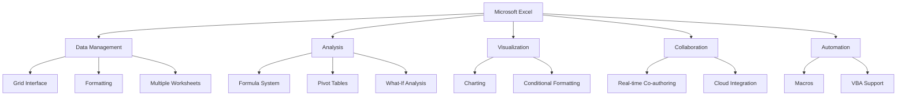

This SRS document will provide detailed specifications for each of these core functionalities, as well as non-functional requirements such as performance, security, and usability. It will serve as the foundation for the development of Microsoft Excel, ensuring that the final product meets the high standards expected by users and stakeholders alike.

# PRODUCT DESCRIPTION

## PRODUCT PERSPECTIVE

Microsoft Excel is a cornerstone application within the larger Microsoft Office suite, designed to seamlessly integrate with other productivity tools such as Word, PowerPoint, and Outlook. As a standalone product, Excel serves as a comprehensive spreadsheet solution, but its true power is realized when utilized as part of the broader Microsoft ecosystem.

Excel operates within the following contexts:

1. Desktop Application: Native software for Windows and macOS operating systems.
2. Web Application: Browser-based version accessible through Microsoft 365.
3. Mobile Application: Optimized versions for iOS and Android devices.
4. Cloud Integration: Seamless connection with OneDrive and SharePoint for storage and collaboration.

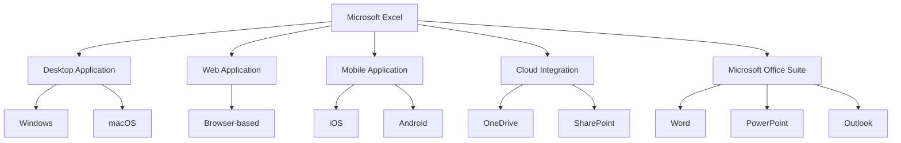

Excel interacts with external systems through various means:

1. File System: Reading and writing files in various formats (XLSX, CSV, XML, etc.)
2. Databases: Connecting to and querying external data sources.
3. Web Services: Integrating with online data providers and APIs.
4. Add-ins: Extending functionality through third-party integrations.

## PRODUCT FUNCTIONS

Microsoft Excel provides a wide array of functions to support data management, analysis, and visualization:

1. Data Entry and Management
   - Grid-based interface for structured data input
   - Support for multiple data types (numbers, text, dates, currencies)
   - Data validation and error checking

2. Calculation and Analysis
   - Comprehensive formula system with 400+ built-in functions
   - Custom function creation using VBA
   - Pivot Tables for data summarization and analysis
   - What-if analysis tools (Goal Seek, Scenario Manager)

3. Data Visualization
   - Wide range of chart types for data representation
   - Conditional formatting for visual data analysis
   - Sparklines for inline data trends

4. Collaboration and Sharing
   - Real-time co-authoring capabilities
   - Commenting and review features
   - Granular sharing permissions

5. Automation and Customization
   - Macro recording for task automation
   - VBA programming for advanced customization
   - Support for add-ins and extensions

6. Data Import and Export
   - Integration with various file formats and databases
   - Web queries for online data retrieval
   - Power Query for advanced data transformation

7. Security and Protection
   - Workbook and worksheet protection options
   - Data encryption for sensitive information
   - Integration with Microsoft's authentication systems

## USER CHARACTERISTICS

Microsoft Excel caters to a diverse user base with varying levels of expertise:

1. Novice Users
   - Limited spreadsheet experience
   - Primarily use basic data entry and simple formulas
   - Rely heavily on templates and guided features

2. Intermediate Users
   - Comfortable with common Excel functions and features
   - Create basic charts and use Pivot Tables
   - Perform data analysis using built-in tools

3. Advanced Users
   - Proficient in complex formulas and advanced Excel features
   - Create sophisticated models and automate tasks with macros
   - Develop custom solutions using VBA

4. Data Analysts
   - Expertise in data manipulation and statistical analysis
   - Utilize advanced analytical features and integrate with external data sources
   - Create complex dashboards and reports

5. Financial Professionals
   - Specialize in financial modeling and forecasting
   - Heavy use of Excel's financial functions and what-if analysis tools
   - Require high precision and auditability in calculations

6. Managers and Executives
   - Focus on data interpretation and decision-making
   - Rely on summarized reports and visualizations
   - Need easy-to-use interfaces for quick insights

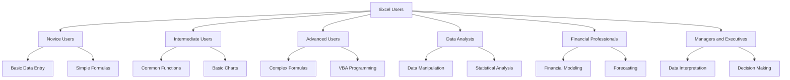

## CONSTRAINTS

1. Technical Constraints
   - Must maintain backward compatibility with previous Excel file formats
   - Performance optimization required for large datasets (up to 1 million rows)
   - Cross-platform consistency across Windows, macOS, web, and mobile versions

2. Regulatory Constraints
   - Compliance with data protection regulations (e.g., GDPR, CCPA)
   - Adherence to accessibility standards (WCAG 2.1 AA)
   - Compliance with industry-specific regulations (e.g., HIPAA for healthcare data)

3. Business Constraints
   - Integration with existing Microsoft Office suite and services
   - Alignment with Microsoft's licensing and subscription models
   - Compatibility with third-party add-ins and extensions

4. User Interface Constraints
   - Consistency with Microsoft Office design language and UX patterns
   - Support for high DPI displays and touch interfaces
   - Localization requirements for multiple languages and regions

5. Security Constraints
   - Implementation of robust encryption for data at rest and in transit
   - Integration with Microsoft's authentication and authorization systems
   - Regular security audits and vulnerability assessments

6. Performance Constraints
   - Maximum file size limit of 2GB for optimal performance
   - Response time for common operations not to exceed 1 second
   - Memory usage optimization for low-end devices

## ASSUMPTIONS AND DEPENDENCIES

Assumptions:
1. Users have basic computer literacy and familiarity with spreadsheet concepts
2. The majority of users will have internet connectivity for cloud features
3. Microsoft will provide necessary resources and access to internal APIs
4. The project will follow Agile development methodologies
5. Existing Excel users will be willing to upgrade to the new version

Dependencies:
1. Microsoft Office Suite: Integration with other Office applications
2. Windows and macOS: For desktop versions
3. Web Browsers: Chrome, Firefox, Safari, and Edge for web version
4. Mobile OS: iOS and Android for mobile applications
5. Microsoft Azure: For cloud services and backend infrastructure
6. OneDrive: For cloud storage and syncing capabilities
7. Microsoft Account System: For user authentication and licensing
8. Third-party Libraries: For specific functionalities (e.g., advanced charting)
9. App Stores: For distribution of mobile applications
10. Microsoft Update Services: For delivering software updates

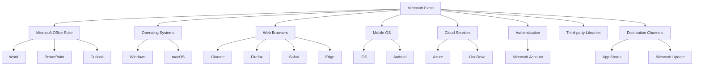

This comprehensive product description provides a clear understanding of Microsoft Excel's position within the larger ecosystem, its core functions, target users, constraints, and key assumptions and dependencies. This information will guide the development process and ensure that the final product meets the needs of its diverse user base while adhering to technical and business requirements.

Here's a PROCESS FLOWCHART section for the Microsoft Excel Software Requirements Specification (SRS) using Mermaid JS:

# PROCESS FLOWCHART

The following flowchart illustrates the high-level process flow for key operations in Microsoft Excel:

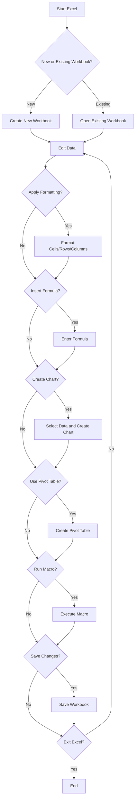

This flowchart represents the core workflow of Microsoft Excel, including:

1. Starting Excel and choosing between creating a new workbook or opening an existing one.
2. Editing data within the workbook.
3. Applying formatting to cells, rows, or columns.
4. Inserting formulas for calculations.
5. Creating charts for data visualization.
6. Using pivot tables for data analysis.
7. Running macros for automation.
8. Saving changes to the workbook.
9. Exiting Excel or continuing to work on the document.

The flowchart demonstrates the iterative nature of working with Excel, allowing users to perform multiple operations on their data before saving and exiting. It also highlights the key features of Excel, including data manipulation, analysis, and visualization tools.

This process flow aligns with the previously mentioned features and functionalities of Microsoft Excel, ensuring consistency with the overall Software Requirements Specification document.

Here's a breakdown of Microsoft Excel's features with the requested sub-sections:

1. Grid Interface

ID: F001
DESCRIPTION: The core spreadsheet interface with cells organized in rows and columns, allowing data input and manipulation.
PRIORITY: High

| Requirement ID | Requirement Description | Priority |
|----------------|-------------------------|----------|
| F001-1 | Support for up to 1,048,576 rows and 16,384 columns | High |
| F001-2 | Cell merging and splitting capabilities | Medium |
| F001-3 | Freeze panes functionality | Medium |
| F001-4 | Auto-fill and flash fill features | High |
| F001-5 | Cell formatting options (font, color, borders, etc.) | High |

2. Formula System

ID: F002
DESCRIPTION: A comprehensive set of built-in functions and the ability to create custom formulas for data calculation and analysis.
PRIORITY: High

| Requirement ID | Requirement Description | Priority |
|----------------|-------------------------|----------|
| F002-1 | Support for 400+ built-in functions | High |
| F002-2 | Ability to create and save custom functions | Medium |
| F002-3 | Formula autocomplete and suggestion feature | High |
| F002-4 | Array formula support | Medium |
| F002-5 | Error checking and formula auditing tools | High |

3. Data Visualization

ID: F003
DESCRIPTION: Tools for creating charts, graphs, and other visual representations of data.
PRIORITY: High

| Requirement ID | Requirement Description | Priority |
|----------------|-------------------------|----------|
| F003-1 | Support for 20+ chart types | High |
| F003-2 | Customizable chart elements (titles, legends, axes) | Medium |
| F003-3 | Dynamic chart updates with data changes | High |
| F003-4 | Sparklines for in-cell mini charts | Medium |
| F003-5 | Conditional formatting with data bars and color scales | High |

4. Data Analysis Tools

ID: F004
DESCRIPTION: Advanced features for analyzing and summarizing large datasets.
PRIORITY: High

| Requirement ID | Requirement Description | Priority |
|----------------|-------------------------|----------|
| F004-1 | Pivot Table functionality | High |
| F004-2 | Data sorting and filtering capabilities | High |
| F004-3 | What-if analysis tools (Goal Seek, Scenario Manager) | Medium |
| F004-4 | Data validation features | Medium |
| F004-5 | Solver add-in for optimization problems | Low |

5. Collaboration Features

ID: F005
DESCRIPTION: Tools enabling multiple users to work on the same spreadsheet simultaneously.
PRIORITY: High

| Requirement ID | Requirement Description | Priority |
|----------------|-------------------------|----------|
| F005-1 | Real-time co-authoring capabilities | High |
| F005-2 | Comments and review features | Medium |
| F005-3 | Version history and document recovery | High |
| F005-4 | Sharing options with granular permissions | Medium |
| F005-5 | Integration with Microsoft Teams for collaboration | Medium |

6. Cross-Platform Compatibility

ID: F006
DESCRIPTION: Ensure Excel functions consistently across different operating systems and devices.
PRIORITY: High

| Requirement ID | Requirement Description | Priority |
|----------------|-------------------------|----------|
| F006-1 | Windows desktop application | High |
| F006-2 | macOS desktop application | High |
| F006-3 | Web-based version | High |
| F006-4 | Mobile applications for iOS and Android | Medium |
| F006-5 | Consistent user interface and functionality across platforms | High |

7. Automation and Extensibility

ID: F007
DESCRIPTION: Features allowing users to automate tasks and extend Excel's functionality.
PRIORITY: Medium

| Requirement ID | Requirement Description | Priority |
|----------------|-------------------------|----------|
| F007-1 | Macro recording functionality | Medium |
| F007-2 | VBA support for custom programming | Medium |
| F007-3 | Support for add-ins and extensions | Medium |
| F007-4 | Power Query for advanced data import and transformation | Medium |
| F007-5 | API for third-party integrations | Low |

8. Cloud Integration

ID: F008
DESCRIPTION: Features for cloud storage, syncing, and accessing Excel from anywhere.
PRIORITY: High

| Requirement ID | Requirement Description | Priority |
|----------------|-------------------------|----------|
| F008-1 | OneDrive integration for cloud storage | High |
| F008-2 | Automatic saving and version history in the cloud | High |
| F008-3 | Cross-device syncing of files and settings | High |
| F008-4 | Web-based file management interface | Medium |
| F008-5 | Integration with other Microsoft cloud services | Medium |

9. Security and Data Protection

ID: F009
DESCRIPTION: Features to ensure data security and protect sensitive information.
PRIORITY: High

| Requirement ID | Requirement Description | Priority |
|----------------|-------------------------|----------|
| F009-1 | Workbook and worksheet protection options | High |
| F009-2 | Data encryption for sensitive information | High |
| F009-3 | Multi-factor authentication support | High |
| F009-4 | Compliance with data protection regulations (e.g., GDPR) | High |
| F009-5 | Audit trails for tracking changes and access | Medium |

10. Performance and Scalability

ID: F010
DESCRIPTION: Ensure Excel can handle large datasets efficiently and perform calculations quickly.
PRIORITY: High

| Requirement ID | Requirement Description | Priority |
|----------------|-------------------------|----------|
| F010-1 | Support for workbooks up to 1GB in size | High |
| F010-2 | Multi-threaded calculation for faster processing | High |
| F010-3 | Efficient memory usage and management | High |
| F010-4 | Quick loading of large datasets | High |
| F010-5 | Scalable architecture to support future enhancements | Medium |

This feature breakdown maintains consistency with the previously mentioned technology and framework choices, including the use of Microsoft's existing infrastructure, cross-platform development, and integration with other Microsoft Office applications and cloud services.

# NON-FUNCTIONAL REQUIREMENTS

## PERFORMANCE

1. Response Time
   - Excel shall load a workbook of up to 10MB in size within 3 seconds on standard hardware.
   - Calculations involving up to 100,000 cells shall complete within 1 second.
   - Chart rendering for datasets up to 10,000 points shall occur within 2 seconds.

2. Throughput
   - The system shall support up to 1,000 concurrent users per server instance.
   - Excel shall handle workbooks with up to 1 million rows and 16,384 columns.
   - Real-time collaboration features shall support up to 100 simultaneous editors per workbook.

3. Resource Usage
   - Excel desktop application shall not consume more than 2GB of RAM under normal usage conditions.
   - CPU utilization shall not exceed 70% during complex calculations.
   - Storage requirements for the full application shall not exceed 5GB.

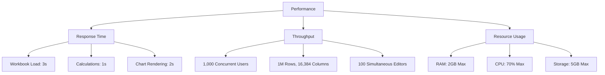

## SAFETY

1. Data Protection
   - Excel shall automatically save user data every 5 minutes to prevent data loss.
   - In case of application crash, Excel shall recover unsaved changes upon restart.

2. Error Handling
   - Excel shall gracefully handle and log all runtime errors without crashing.
   - Users shall be provided with clear error messages and suggested actions for recovery.

3. Input Validation
   - Excel shall validate all user inputs to prevent formula errors and data corruption.
   - The system shall warn users before executing potentially destructive operations (e.g., mass deletions).

4. Backup and Recovery
   - Excel shall maintain version history for the last 50 saves or 30 days, whichever is greater.
   - The system shall provide options for users to restore previous versions of their workbooks.

## SECURITY

1. Authentication
   - Excel shall support multi-factor authentication for Microsoft account logins.
   - The system shall enforce strong password policies, including minimum length and complexity requirements.

2. Authorization
   - Excel shall implement role-based access control for shared workbooks.
   - The system shall support granular permissions for viewing, editing, and sharing workbooks.

3. Data Encryption
   - All data transmissions between client and server shall use TLS 1.3 encryption.
   - Excel shall support AES-256 encryption for workbooks containing sensitive information.

4. Privacy
   - Excel shall comply with GDPR, CCPA, and other relevant data protection regulations.
   - The system shall provide users with options to control data collection and usage for analytics.

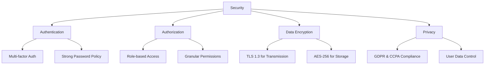

## QUALITY

1. Availability
   - Excel web services shall maintain 99.9% uptime, measured monthly.
   - Planned maintenance downtimes shall not exceed 4 hours per month and shall be scheduled during off-peak hours.

2. Maintainability
   - The system architecture shall be modular to facilitate easy updates and feature additions.
   - Excel shall provide detailed logging for troubleshooting and performance monitoring.

3. Usability
   - Excel shall maintain a consistent user interface across all platforms (desktop, web, mobile).
   - The system shall provide context-sensitive help and tooltips for all features.
   - Excel shall support localization in at least 25 languages.

4. Scalability
   - The system architecture shall support horizontal scaling to handle increased user load.
   - Excel shall be capable of efficiently processing workbooks up to 1GB in size.

5. Reliability
   - The mean time between failures (MTBF) for Excel shall be at least 720 hours of operation.
   - The system shall have a recovery time objective (RTO) of less than 15 minutes in case of failure.

## COMPLIANCE

1. Legal Compliance
   - Excel shall comply with all relevant intellectual property laws and licensing agreements.
   - The system shall adhere to local data residency requirements for cloud storage.

2. Regulatory Compliance
   - Excel shall meet the requirements of SOC 2 Type II certification for cloud services.
   - The system shall comply with HIPAA regulations when handling healthcare-related data.

3. Standards Compliance
   - Excel shall adhere to the OpenDocument Format (ODF) standard for compatibility.
   - The system shall comply with WCAG 2.1 Level AA for accessibility.

4. Industry-Specific Compliance
   - Excel shall support features required for Sarbanes-Oxley Act (SOX) compliance in financial reporting.
   - The system shall provide audit trails and data lineage features for regulatory reporting.

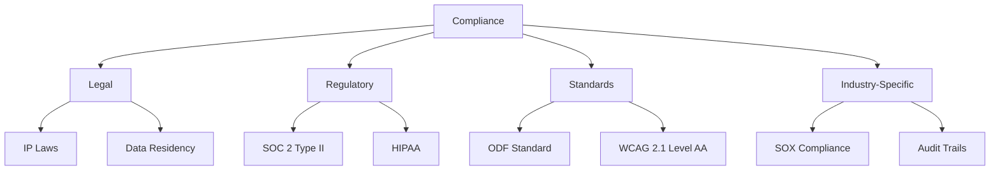

These non-functional requirements ensure that Microsoft Excel meets high standards of performance, safety, security, quality, and compliance across all platforms and use cases. They align with the previously mentioned technology choices and framework decisions, including cross-platform development, cloud integration, and Microsoft's existing infrastructure.

# DATA REQUIREMENTS

## DATA MODELS

Microsoft Excel's data model is designed to efficiently represent and manage spreadsheet data across various components of the application. The following entity-relationship diagram illustrates the core data structures:

```mermaid
erDiagram
    WORKBOOK ||--|{ WORKSHEET : contains
    WORKSHEET ||--|{ CELL : contains
    CELL ||--o| FORMULA : may_have
    CELL ||--o| VALUE : contains
    CELL ||--o| STYLE : has
    WORKSHEET ||--o{ CHART : may_have
    WORKSHEET ||--o{ PIVOT_TABLE : may_have
    WORKBOOK ||--o{ NAMED_RANGE : may_have
    WORKBOOK ||--o{ MACRO : may_have
    USER ||--|{ WORKBOOK : owns
    USER ||--o{ SHARED_WORKBOOK : collaborates_on

    WORKBOOK {
        string id
        string name
        datetime created_date
        datetime modified_date
        string owner_id
    }
    WORKSHEET {
        string id
        string name
        int index
        string workbook_id
    }
    CELL {
        string id
        string worksheet_id
        string column
        int row
    }
    FORMULA {
        string id
        string expression
    }
    VALUE {
        string id
        string data_type
        string content
    }
    STYLE {
        string id
        string font
        string color
        string background
        string border
    }
    CHART {
        string id
        string type
        string data_range
    }
    PIVOT_TABLE {
        string id
        string source_range
    }
    NAMED_RANGE {
        string id
        string name
        string range
    }
    MACRO {
        string id
        string name
        string code
    }
    USER {
        string id
        string username
        string email
    }
    SHARED_WORKBOOK {
        string workbook_id
        string user_id
        string permission_level
    }
```

This data model supports the core functionality of Excel, including:
- Hierarchical structure of workbooks, worksheets, and cells
- Formula calculation and cell value storage
- Styling and formatting of cells
- Advanced features such as charts, pivot tables, and macros
- User ownership and collaboration on workbooks

## DATA STORAGE

Excel's data storage strategy is designed to ensure data integrity, availability, and scalability across its various platforms (desktop, web, and mobile).

1. Local Storage (Desktop Application)
   - File Format: XLSX (Office Open XML)
   - Compression: ZIP compression for reduced file size
   - Auto-save: Temporary files stored locally for recovery
   - File System: Direct interaction with the operating system's file system

2. Cloud Storage (Web and Mobile Applications)
   - Primary Storage: Azure Blob Storage for scalability and durability
   - Database: Azure Cosmos DB for metadata and user information
   - Caching: Azure Redis Cache for improved performance

3. Data Retention
   - User Files: Retained indefinitely unless deleted by the user
   - Version History: Last 100 versions or 30 days, whichever is greater
   - Deleted Items: Soft delete with 30-day recovery period

4. Redundancy and Backup
   - Geo-redundant storage (GRS) in Azure for cloud-stored files
   - Daily backups with 30-day retention period
   - Point-in-time restore capabilities for the last 7 days

5. Recovery
   - Automated recovery for unsaved changes in case of application crash
   - User-initiated restore from version history
   - Disaster recovery plan with RPO (Recovery Point Objective) of 1 hour and RTO (Recovery Time Objective) of 4 hours

6. Scalability
   - Horizontal scaling of Azure services to handle increased load
   - Sharding of large datasets across multiple storage nodes
   - Dynamic allocation of resources based on usage patterns

## DATA PROCESSING

Excel's data processing capabilities are designed to handle large datasets efficiently while ensuring data security and integrity.

1. Calculation Engine
   - Multi-threaded processing for complex calculations
   - Dependency tracking for optimized recalculation
   - Lazy evaluation to improve performance

2. Data Import/Export
   - Support for various file formats (CSV, XML, JSON, etc.)
   - Streaming processing for large file imports
   - Batch processing for data exports

3. Real-time Collaboration
   - Operational Transformation (OT) for concurrent editing
   - Differential sync to minimize data transfer

4. Data Security
   - End-to-end encryption for data in transit (TLS 1.3)
   - At-rest encryption using Azure Storage Service Encryption (256-bit AES)
   - Row-level security for shared workbooks
   - Data Loss Prevention (DLP) policies integration

5. Data Flow

The following diagram illustrates the high-level data flow in the Excel ecosystem:

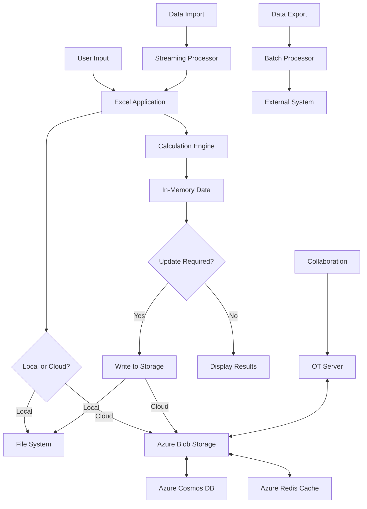

This data flow ensures efficient processing of user inputs, seamless collaboration, and secure storage of data across all platforms. The use of Azure services allows for scalable and reliable data management, while the local processing capabilities of the desktop application provide high performance for resource-intensive operations.

# EXTERNAL INTERFACES

## USER INTERFACES

Microsoft Excel will provide a user-friendly and intuitive interface across all supported platforms (Windows, macOS, web, and mobile). The interface will be designed to accommodate both novice and advanced users, with a focus on accessibility and efficiency.

Key UI requirements:

1. Ribbon-style toolbar for easy access to features
2. Customizable quick access toolbar
3. Grid-based worksheet area for data input and manipulation
4. Formula bar for complex calculations
5. Status bar for quick information and view options
6. Sidebar for additional functionality (e.g., formatting, chart properties)
7. Dialog boxes for advanced features and settings
8. Context menus for quick access to relevant options
9. Drag-and-drop functionality for data manipulation and chart creation
10. Zoom and pan controls for easy navigation of large spreadsheets

The interface will adhere to Microsoft's Fluent Design System, ensuring consistency with other Office applications and modern UI principles.

[Placeholder for UI mockups]

Accessibility requirements:
- High contrast mode support
- Screen reader compatibility
- Keyboard navigation for all features
- Customizable font sizes and color schemes
- WCAG 2.1 AA compliance

## SOFTWARE INTERFACES

Microsoft Excel will interact with various software systems and components to provide a comprehensive and integrated user experience:

1. Microsoft Office Suite Integration
   - Interface with Word for data import/export and object linking
   - Integration with PowerPoint for chart and table insertion
   - Outlook integration for sending spreadsheets via email and scheduling data refreshes

2. Operating System Integration
   - Windows: Utilize Windows API for file system access, clipboard operations, and system notifications
   - macOS: Leverage macOS APIs for similar functionality and ensure native look and feel

3. Database Connectivity
   - ODBC and OLEDB support for connecting to various database systems
   - Direct integration with Microsoft SQL Server and Azure SQL Database
   - Support for importing data from MySQL, PostgreSQL, and Oracle databases

4. Cloud Services Integration
   - OneDrive API for cloud storage and file synchronization
   - SharePoint API for enterprise-level document management and collaboration
   - Azure Active Directory for user authentication and access control

5. Web Services and APIs
   - RESTful API for third-party integrations and data exchange
   - Support for OAuth 2.0 for secure API authentication
   - Integration with popular web services (e.g., Google Sheets API for import/export)

6. Add-in and Extension Support
   - Office Add-in API for extending Excel functionality
   - Support for VBA (Visual Basic for Applications) for custom macros and functions
   - JavaScript API for web-based extensions

7. Mobile Platform Integration
   - iOS: Integration with iOS SDK for native app functionality
   - Android: Utilization of Android SDK for platform-specific features

8. Version Control System Integration
   - Git integration for tracking changes in spreadsheets (enterprise feature)

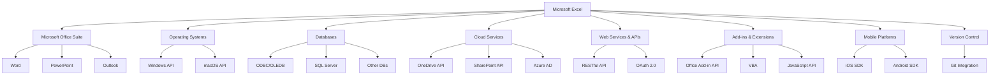

## COMMUNICATION INTERFACES

Microsoft Excel will utilize various communication protocols and data formats to ensure seamless data exchange and integration with external systems:

1. Network Protocols
   - HTTP/HTTPS for web-based communication and API interactions
   - WebSocket for real-time collaboration features
   - FTP/SFTP for file transfer operations (e.g., importing large datasets)
   - SMB/CIFS for network file system access

2. Data Formats
   - XML for data exchange and Office Open XML format (.xlsx)
   - JSON for API communications and data interchange
   - CSV for simple data import/export
   - PDF for exporting spreadsheets as static documents

3. Collaboration Protocols
   - Microsoft's Real-Time Collaboration Protocol for co-authoring features
   - WebRTC for peer-to-peer data sharing in web version

4. Authentication Protocols
   - OAuth 2.0 for secure API authentication
   - SAML for enterprise single sign-on integration
   - OpenID Connect for user authentication in web and mobile versions

5. Encryption Protocols
   - TLS 1.3 for secure data transmission
   - AES-256 for data encryption at rest

6. Synchronization Protocols
   - Microsoft Sync Framework for data synchronization across devices
   - Delta sync protocol for efficient updates of large spreadsheets

7. Notification Systems
   - WebHooks for event-driven integrations with external systems
   - Push notifications for mobile app alerts

8. Printing Protocols
   - IPP (Internet Printing Protocol) for network printing support
   - PDF/XPS for virtual printing and document generation

```mermaid
graph TD
    A[Communication Interfaces] --> B[Network Protocols]
    A --> C[Data Formats]
    A --> D[Collaboration Protocols]
    A --> E[Authentication Protocols]
    A --> F[Encryption Protocols]
    A --> G[Synchronization Protocols]
    A --> H[Notification Systems]
    A --> I[Printing Protocols]
    B --> B1[HTTP/HTTPS]
    B --> B2[WebSocket]
    B --> B3[FTP/SFTP]
    B --> B4[SMB/CIFS]
    C --> C1[XML]
    C --> C2[JSON]
    C --> C3[CSV]
    C --> C4[PDF]
    D --> D1[Real-Time Collaboration]
    D --> D2[WebRTC]
    E --> E1[OAuth 2.0]
    E --> E2[SAML]
    E --> E3[OpenID Connect]
    F --> F1[TLS 1.3]
    F --> F2[AES-256]
    G --> G1[MS Sync Framework]
    G --> G2[Delta Sync]
    H --> H1[WebHooks]
    H --> H2[Push Notifications]
    I --> I1[IPP]
    I --> I2[PDF/XPS]
```

These communication interfaces will ensure that Microsoft Excel can effectively interact with a wide range of external systems, providing users with a seamless and integrated experience across various platforms and use cases.

# APPENDICES

## GLOSSARY

- Workbook: A file that contains one or more worksheets to organize data.
- Worksheet: A single spreadsheet within a workbook, consisting of cells organized in rows and columns.
- Cell: The intersection of a row and column in a worksheet where data can be entered.
- Formula: An expression that calculates the value of a cell.
- Function: A predefined formula that performs calculations using specific values in a particular order.
- Pivot Table: An interactive tool that extracts, organizes, and summarizes data from a larger dataset.
- Macro: A series of commands and instructions grouped together as a single command to accomplish a task automatically.
- VBA: Visual Basic for Applications, a programming language used to create macros in Excel.
- Ribbon: The strip of buttons and icons at the top of the Excel window that organizes features into logical groups.
- Sparkline: A small chart in a worksheet cell that provides a visual representation of data.
- Named Range: A defined area of cells with a custom name, which can be used in formulas and functions.
- Data Validation: A feature that restricts the type of data or values that users can enter into a cell.
- Conditional Formatting: A feature that changes the appearance of cells based on specified conditions.
- Solver: An Excel add-in used for optimization problems and what-if analysis.
- Power Query: A data connection technology that lets you discover, connect, combine, and refine data sources to meet your analysis needs.

## ACRONYMS

- API: Application Programming Interface
- CSV: Comma-Separated Values
- GDPR: General Data Protection Regulation
- HIPAA: Health Insurance Portability and Accountability Act
- HTTP: Hypertext Transfer Protocol
- HTTPS: Hypertext Transfer Protocol Secure
- JSON: JavaScript Object Notation
- ODBC: Open Database Connectivity
- OLEDB: Object Linking and Embedding Database
- PDF: Portable Document Format
- REST: Representational State Transfer
- RPO: Recovery Point Objective
- RTO: Recovery Time Objective
- SAML: Security Assertion Markup Language
- SDK: Software Development Kit
- SMB: Server Message Block
- SOC: Service Organization Control
- SOX: Sarbanes-Oxley Act
- SQL: Structured Query Language
- SSL: Secure Sockets Layer
- TLS: Transport Layer Security
- UI: User Interface
- UX: User Experience
- VBA: Visual Basic for Applications
- WCAG: Web Content Accessibility Guidelines
- XML: Extensible Markup Language
- XLSX: Excel Spreadsheet (Office Open XML)

## ADDITIONAL REFERENCES

1. Microsoft Office Developer Documentation: https://docs.microsoft.com/en-us/office/developer/

2. Excel JavaScript API reference: https://docs.microsoft.com/en-us/javascript/api/excel

3. Microsoft Graph API documentation: https://docs.microsoft.com/en-us/graph/

4. Office Add-ins documentation: https://docs.microsoft.com/en-us/office/dev/add-ins/

5. Microsoft Azure documentation: https://docs.microsoft.com/en-us/azure/

6. Web Content Accessibility Guidelines (WCAG) 2.1: https://www.w3.org/TR/WCAG21/

7. OAuth 2.0 specification: https://oauth.net/2/

8. OpenID Connect documentation: https://openid.net/connect/

9. Microsoft Security Development Lifecycle: https://www.microsoft.com/en-us/securityengineering/sdl/

10. Microsoft Fluent Design System: https://www.microsoft.com/design/fluent/

11. Excel Formula Reference: https://support.microsoft.com/en-us/office/excel-functions-alphabetical-b3944572-255d-4efb-bb96-c6d90033e188

12. Power Query M language specification: https://docs.microsoft.com/en-us/powerquery-m/

13. VBA Language Reference: https://docs.microsoft.com/en-us/office/vba/api/overview/excel

14. Microsoft Learn Excel Training: https://docs.microsoft.com/en-us/learn/paths/excel-fundamentals/

15. Office Open XML file formats: https://docs.microsoft.com/en-us/office/open-xml/open-xml-sdk

These additional references provide comprehensive technical documentation, specifications, and learning resources that will be valuable for the development team throughout the Microsoft Excel project. They cover various aspects of the project, including API references, security guidelines, accessibility standards, and specific Excel functionalities.