# INTRODUCTION

## SYSTEM OVERVIEW

Microsoft Excel is a comprehensive spreadsheet application designed to provide users with powerful data management, analysis, and visualization capabilities. As a core component of the Microsoft Office suite, Excel serves a wide range of users, from individuals managing personal finances to large enterprises conducting complex data analysis.

The system is composed of several key components that work together to deliver a seamless user experience across multiple platforms:

1. Core Application
   - Desktop versions for Windows and macOS
   - Web-based version accessible through browsers
   - Mobile applications for iOS and Android devices

2. Calculation Engine
   - Handles complex formulas and functions
   - Supports real-time calculation updates

3. Data Management System
   - Manages data input, storage, and retrieval
   - Supports various file formats and data sources

4. Visualization Tools
   - Creates charts, graphs, and other visual representations of data
   - Provides conditional formatting and data bars

5. Collaboration Platform
   - Enables real-time co-authoring and sharing
   - Integrates with Microsoft 365 for enhanced collaboration

6. Extensibility Framework
   - Supports add-ins and custom functions
   - Allows for VBA and JavaScript-based extensions

7. Cloud Services
   - Provides cloud storage and synchronization
   - Enables cross-device access and backup

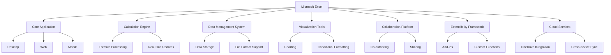

The system architecture is designed to be scalable, maintainable, and secure, leveraging Microsoft's cloud infrastructure to provide a robust and reliable service. Key technological components include:

- Frontend: HTML5, CSS3, JavaScript (for web version), C++ (for desktop version), Swift (for iOS), and Kotlin (for Android)
- Backend: .NET Core, ASP.NET Core Web API
- Database: Azure SQL Database for structured data, Azure Cosmos DB for document storage
- Cloud Services: Microsoft Azure for hosting, storage, and additional services
- Authentication: Azure Active Directory, OAuth 2.0
- API: RESTful API for third-party integrations

Excel's system is designed to handle large datasets efficiently, with support for up to 1,048,576 rows and 16,384 columns in a single worksheet. The application employs multi-threading and lazy loading techniques to ensure optimal performance even with complex calculations and large data volumes.

Security is a paramount concern, with end-to-end encryption for data in transit and at rest, multi-factor authentication support, and compliance with various international data protection regulations.

The system's modular architecture allows for continuous improvement and feature additions, ensuring that Microsoft Excel remains at the forefront of spreadsheet and data analysis technology. Regular updates and feature releases are managed through a robust CI/CD pipeline, allowing for rapid deployment of new functionalities and security patches.

This comprehensive system overview provides a high-level understanding of Microsoft Excel's architecture and key components, setting the stage for more detailed specifications in the subsequent sections of this technical document.

# SYSTEM ARCHITECTURE

## PROGRAMMING LANGUAGES

The following programming languages will be used in the development of Microsoft Excel, chosen for their specific strengths and suitability for different components of the system:

| Language | Purpose | Justification |
|----------|---------|---------------|
| C++ | Core calculation engine, desktop application | High performance, low-level control, extensive libraries |
| C# | Backend services, Windows-specific features | Strong integration with .NET ecosystem, type safety |
| JavaScript/TypeScript | Web application, Office Add-ins | Wide browser support, rich ecosystem, strong typing (TypeScript) |
| Swift | iOS application | Native iOS development, performance, modern language features |
| Kotlin | Android application | Official language for Android, interoperability with Java |
| Python | Data analysis features, scripting | Rich data science libraries, ease of use for end-user scripting |
| VBA | Macro programming | Backward compatibility, user-familiar scripting language |
| SQL | Database queries | Standard language for relational database interactions |

## HIGH-LEVEL ARCHITECTURE DIAGRAM

The following diagram provides an overview of the Microsoft Excel system architecture:

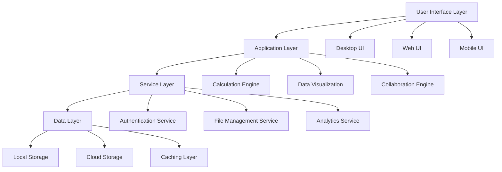

## COMPONENT DIAGRAMS

### Calculation Engine Component

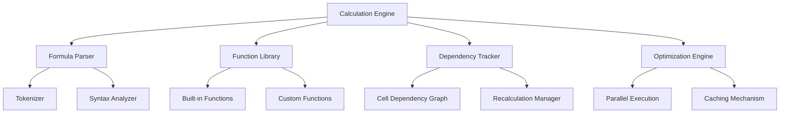

### Data Visualization Component

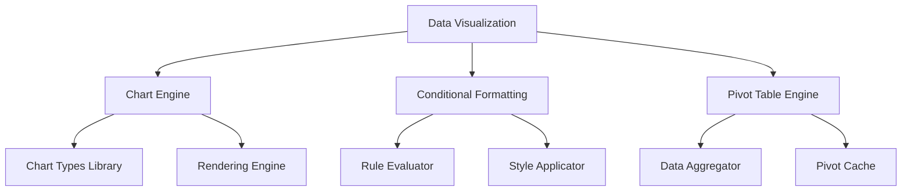

## SEQUENCE DIAGRAMS

### Formula Calculation Sequence

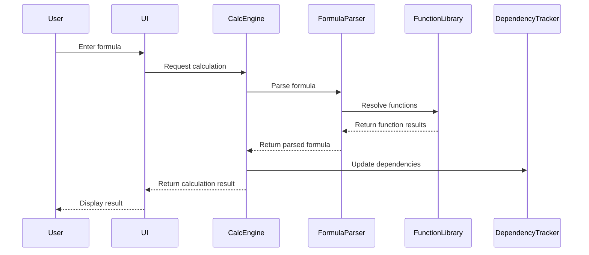

### Collaborative Editing Sequence

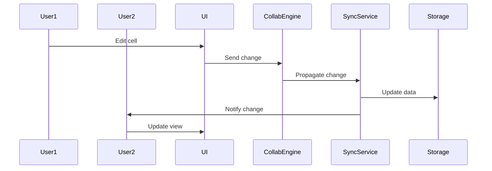

## DATA-FLOW DIAGRAM

The following diagram illustrates how data flows through the Microsoft Excel system:

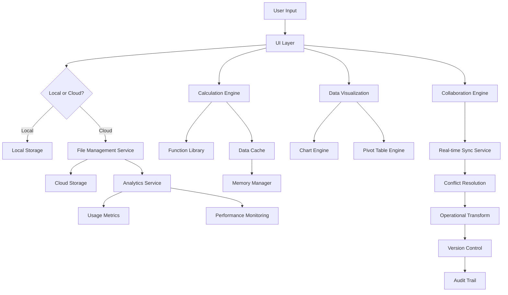

This data flow diagram shows how user input is processed through various components of the Excel system, including local and cloud storage options, the calculation engine, data visualization tools, and collaboration features. It also illustrates how data is processed for analytics and performance monitoring.

The system architecture described here maintains consistency with the previously mentioned technology choices, including the use of Microsoft's cloud infrastructure (Azure), cross-platform development, and integration with other Microsoft Office applications and services. The component breakdowns and interaction flows align with the features and requirements outlined in earlier sections of the Technical Specifications document.

# SYSTEM DESIGN

## PROGRAMMING LANGUAGES

The following programming languages will be used in the development of Microsoft Excel, chosen for their specific strengths and suitability for different components of the system:

| Language | Purpose | Justification |
|----------|---------|---------------|
| C++ | Core calculation engine, desktop application | High performance, low-level control, extensive libraries |
| C# | Backend services, Windows-specific features | Strong integration with .NET ecosystem, type safety |
| JavaScript/TypeScript | Web application, Office Add-ins | Wide browser support, rich ecosystem, strong typing (TypeScript) |
| Swift | iOS application | Native iOS development, performance, modern language features |
| Kotlin | Android application | Official language for Android, interoperability with Java |
| Python | Data analysis features, scripting | Rich data science libraries, ease of use for end-user scripting |
| VBA | Macro programming | Backward compatibility, user-familiar scripting language |
| SQL | Database queries | Standard language for relational database interactions |

## DATABASE DESIGN

Microsoft Excel will utilize a hybrid database approach to accommodate various data storage needs:

1. Document Database (Azure Cosmos DB)
   - Purpose: Store workbook metadata, user preferences, and collaboration data
   - Schema:

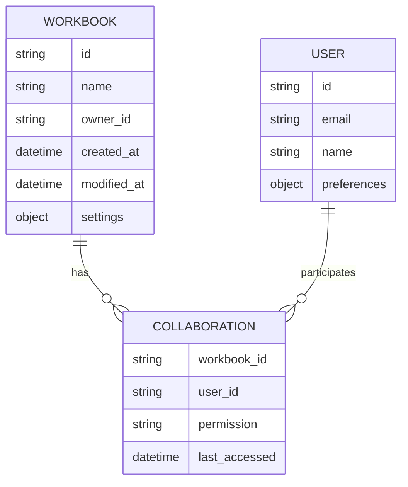

2. Blob Storage (Azure Blob Storage)
   - Purpose: Store actual workbook content and large datasets
   - Organization: Container per user, blob per workbook

3. Cache (Azure Redis Cache)
   - Purpose: Store frequently accessed data and session information
   - Key-value pairs for quick retrieval of workbook metadata and user settings

4. Relational Database (Azure SQL Database)
   - Purpose: Store structured data for reporting, analytics, and complex queries
   - Schema:

```sql
CREATE TABLE UserActivity (
    id INT PRIMARY KEY,
    user_id VARCHAR(50),
    workbook_id VARCHAR(50),
    action_type VARCHAR(20),
    timestamp DATETIME
);

CREATE TABLE FeatureUsage (
    id INT PRIMARY KEY,
    feature_name VARCHAR(50),
    usage_count INT,
    last_used DATETIME
);
```

## API DESIGN

Microsoft Excel will expose a RESTful API for integration with other systems and to support the web and mobile applications. The API will follow OpenAPI (Swagger) specifications.

Key API endpoints:

1. Workbook Management
   - `GET /api/workbooks`: List user's workbooks
   - `POST /api/workbooks`: Create a new workbook
   - `GET /api/workbooks/{id}`: Retrieve a specific workbook
   - `PUT /api/workbooks/{id}`: Update a workbook
   - `DELETE /api/workbooks/{id}`: Delete a workbook

2. Worksheet Operations
   - `GET /api/workbooks/{id}/worksheets`: List worksheets in a workbook
   - `POST /api/workbooks/{id}/worksheets`: Add a new worksheet
   - `PUT /api/workbooks/{id}/worksheets/{sheet_id}`: Update a worksheet

3. Cell Operations
   - `GET /api/workbooks/{id}/worksheets/{sheet_id}/cells/{range}`: Get cell values
   - `PUT /api/workbooks/{id}/worksheets/{sheet_id}/cells/{range}`: Update cell values

4. Formulas and Functions
   - `POST /api/calculate`: Evaluate a formula or function

5. Charts and Visualizations
   - `POST /api/workbooks/{id}/charts`: Create a new chart
   - `GET /api/workbooks/{id}/charts/{chart_id}`: Retrieve chart data

6. Collaboration
   - `POST /api/workbooks/{id}/share`: Share a workbook with other users
   - `GET /api/workbooks/{id}/activities`: Get recent activities on a workbook

Authentication will be handled using OAuth 2.0, and all API communications will be secured using TLS 1.3.

## USER INTERFACE DESIGN

The Microsoft Excel user interface will be designed to be intuitive, efficient, and consistent across all platforms while adapting to the specific capabilities of each.

1. Desktop Application (Windows and macOS)

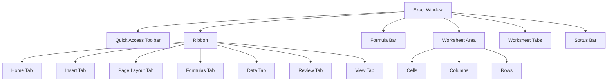

Key UI Components:
- Ribbon: Context-sensitive tabs with categorized commands
- Quick Access Toolbar: Customizable for frequently used commands
- Formula Bar: For viewing and editing cell contents and formulas
- Worksheet Area: Grid for data entry and visualization
- Sidebar: For additional functionality (e.g., formatting, chart properties)

2. Web Application

The web interface will closely mirror the desktop application, with adaptations for browser environments:
- Responsive design to accommodate various screen sizes
- Simplified ribbon for touch-friendly interactions
- Progressive loading of large spreadsheets for improved performance

3. Mobile Applications (iOS and Android)

Mobile interfaces will focus on key functionalities with touch-optimized controls:
- Bottom navigation bar for quick access to essential features
- Swipe gestures for navigating between worksheets
- Contextual menus for cell operations
- Simplified formula entry with touch-friendly controls

Accessibility Considerations:
- High contrast mode support
- Screen reader compatibility
- Keyboard navigation for all features
- Customizable font sizes and color schemes
- WCAG 2.1 AA compliance

The user interface will be implemented using platform-specific technologies:
- Windows: WPF (Windows Presentation Foundation) for native look and feel
- macOS: AppKit for native macOS interface
- Web: React.js for component-based UI development
- iOS: SwiftUI for modern iOS interface
- Android: Jetpack Compose for declarative UI

This system design ensures a cohesive and efficient Microsoft Excel experience across all platforms, leveraging appropriate technologies and adhering to modern design principles while maintaining consistency with the existing Microsoft Office ecosystem.

# TECHNOLOGY STACK

## PROGRAMMING LANGUAGES

The following programming languages will be used in the development of Microsoft Excel:

| Language | Purpose | Justification |
|----------|---------|---------------|
| C++ | Core calculation engine, desktop application | High performance, low-level control, extensive libraries |
| C# | Backend services, Windows-specific features | Strong integration with .NET ecosystem, type safety |
| JavaScript/TypeScript | Web application, Office Add-ins | Wide browser support, rich ecosystem, strong typing (TypeScript) |
| Swift | iOS application | Native iOS development, performance, modern language features |
| Kotlin | Android application | Official language for Android, interoperability with Java |
| Python | Data analysis features, scripting | Rich data science libraries, ease of use for end-user scripting |
| VBA | Macro programming | Backward compatibility, user-familiar scripting language |
| SQL | Database queries | Standard language for relational database interactions |

## FRAMEWORKS AND LIBRARIES

The following frameworks and libraries will be utilized in the development of Microsoft Excel:

| Framework/Library | Purpose | Justification |
|-------------------|---------|---------------|
| .NET Core | Backend services, cross-platform development | Robust, high-performance, cross-platform support |
| React | Web application frontend | Component-based architecture, virtual DOM for performance |
| Electron | Desktop application wrapper | Cross-platform desktop app development using web technologies |
| SwiftUI | iOS UI development | Modern declarative UI framework for iOS |
| Jetpack Compose | Android UI development | Modern declarative UI framework for Android |
| NumPy | Numerical computing for Python | High-performance numerical operations |
| Pandas | Data manipulation and analysis | Powerful data structures and data analysis tools |
| Chart.js | Charting library | Flexible, responsive charts for web and mobile |
| SignalR | Real-time communication | Simplified real-time web functionality |

## DATABASES

The following database systems will be employed in Microsoft Excel:

| Database | Purpose | Justification |
|----------|---------|---------------|
| Azure SQL Database | Primary relational database | Scalable, managed SQL database service |
| Azure Cosmos DB | Document storage for workbook metadata | Globally distributed, multi-model database for high availability |
| Redis | Caching and session management | In-memory data structure store for high-performance caching |
| SQLite | Local storage for desktop and mobile apps | Lightweight, serverless database for offline functionality |

## THIRD-PARTY SERVICES

The following external services and APIs will be integrated into Microsoft Excel:

| Service/API | Purpose | Justification |
|-------------|---------|---------------|
| Azure Active Directory | User authentication and authorization | Secure, scalable identity and access management |
| OneDrive API | Cloud storage and file synchronization | Seamless integration with Microsoft's cloud storage solution |
| Microsoft Graph API | Access to Microsoft 365 data and services | Unified API for accessing Microsoft 365 resources |
| Power BI API | Advanced data visualization and reporting | Integration with Microsoft's business analytics service |
| Bing Maps API | Geospatial data visualization | Map integration for location-based data analysis |
| LinkedIn API | Professional data integration | Enhanced data import options for business users |
| Currency Exchange API | Real-time currency conversion | Up-to-date exchange rates for financial calculations |
| Stock Market API | Real-time stock data | Live stock information for financial analysis |

## TECHNOLOGY STACK DIAGRAM

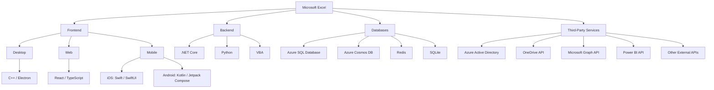

This technology stack ensures a robust, scalable, and feature-rich Microsoft Excel application across all platforms. It leverages Microsoft's existing technologies and services while incorporating industry-standard tools and frameworks for optimal performance and developer productivity.

# SECURITY CONSIDERATIONS

## AUTHENTICATION AND AUTHORIZATION

Microsoft Excel will implement a robust authentication and authorization system to ensure secure access to the application and its features across all platforms (desktop, web, and mobile).

### Authentication

1. Multi-factor Authentication (MFA)
   - Mandatory for all Microsoft account logins
   - Support for various second factors:
     - SMS/Voice call
     - Authenticator app
     - Hardware security keys (FIDO2)

2. Single Sign-On (SSO)
   - Integration with Azure Active Directory for enterprise users
   - Support for SAML 2.0 and OpenID Connect protocols

3. OAuth 2.0
   - Used for API access and third-party integrations
   - Implements the latest OAuth 2.0 security best practices

4. Passwordless Authentication
   - Support for Windows Hello and biometric authentication on compatible devices

### Authorization

1. Role-Based Access Control (RBAC)
   - Predefined roles: Viewer, Editor, Reviewer, Administrator
   - Custom role creation for enterprise customers

2. Granular Permissions
   - Cell-level, sheet-level, and workbook-level permissions
   - Feature-based permissions (e.g., macro execution, external data connections)

3. Conditional Access Policies
   - Integration with Azure AD Conditional Access
   - Enforce access policies based on user location, device health, and risk level

4. Just-In-Time (JIT) Access
   - Temporary elevated permissions for specific tasks
   - Automatic permission revocation after a set time or task completion

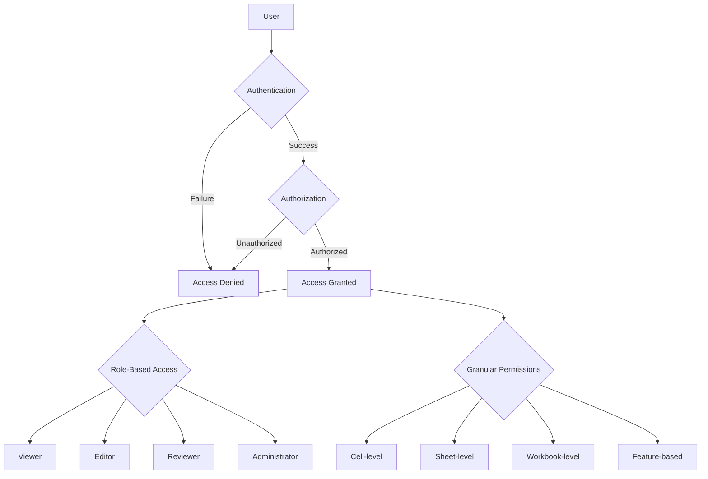

## DATA SECURITY

Microsoft Excel will implement comprehensive data security measures to protect sensitive information throughout its lifecycle.

1. Encryption
   - Data at rest: AES-256 encryption for stored files
   - Data in transit: TLS 1.3 for all network communications
   - End-to-end encryption for highly sensitive workbooks

2. Data Loss Prevention (DLP)
   - Integration with Microsoft 365 DLP policies
   - Content scanning to detect and protect sensitive data (e.g., PII, financial information)
   - Automated actions: block, notify, encrypt based on policy rules

3. Information Rights Management (IRM)
   - Integration with Azure Information Protection
   - Granular control over document actions (view, edit, print, copy)
   - Persistent protection that follows the document

4. Data Residency and Sovereignty
   - Support for data localization requirements
   - Multi-region data storage options in Azure

5. Secure Collaboration
   - Encrypted sharing links with optional password protection
   - Time-limited access for external collaborators
   - Audit trails for all access and modifications

6. Data Backup and Recovery
   - Automated backups with customizable retention policies
   - Point-in-time recovery options
   - Geo-redundant storage for disaster recovery

7. Secure Deletion
   - Soft delete with 30-day recovery period
   - Permanent deletion with secure data wiping techniques

| Data State | Encryption Method | Key Management |
|------------|-------------------|----------------|
| At Rest | AES-256 | Azure Key Vault |
| In Transit | TLS 1.3 | Managed by TLS |
| End-to-End | AES-256 with client-side encryption | User-managed keys |

## SECURITY PROTOCOLS

Microsoft Excel will adhere to industry-standard security protocols and best practices to maintain a robust security posture.

1. Secure Development Lifecycle (SDL)
   - Threat modeling during design phase
   - Regular security code reviews and static analysis
   - Penetration testing before major releases

2. Vulnerability Management
   - Regular vulnerability scans of the application and infrastructure
   - Participation in Microsoft's bug bounty program
   - Timely patching and updates to address security vulnerabilities

3. Incident Response
   - Established incident response plan with defined roles and procedures
   - Integration with Microsoft's security operations center (SOC)
   - Regular incident response drills and tabletop exercises

4. Compliance and Certifications
   - SOC 2 Type II compliance for cloud services
   - ISO 27001 certification for information security management
   - GDPR and CCPA compliance for data protection regulations

5. Security Monitoring and Logging
   - Centralized logging with Azure Monitor
   - Real-time threat detection using Azure Security Center
   - User and entity behavior analytics (UEBA) to detect anomalies

6. Network Security
   - Implementation of Web Application Firewall (WAF)
   - DDoS protection using Azure DDoS Protection
   - Network segmentation and micro-segmentation in cloud environments

7. API Security
   - API gateway for centralized security enforcement
   - Rate limiting and throttling to prevent abuse
   - Input validation and sanitization for all API endpoints

8. Third-Party Security
   - Vendor risk assessments for all integrated third-party services
   - Regular security reviews of add-ins and extensions
   - Sandboxing of third-party code execution

```mermaid
graph TD
    A[Security Protocols] --> B[Secure Development]
    A --> C[Vulnerability Management]
    A --> D[Incident Response]
    A --> E[Compliance]
    A --> F[Monitoring & Logging]
    A --> G[Network Security]
    A --> H[API Security]
    A --> I[Third-Party Security]
    B --> B1[Threat Modeling]
    B --> B2[Code Reviews]
    B --> B3[Penetration Testing]
    C --> C1[Vulnerability Scans]
    C --> C2[Bug Bounty Program]
    C --> C3[Patching]
    D --> D1[Response Plan]
    D --> D2[SOC Integration]
    D --> D3[Drills]
    E --> E1[SOC 2 Type II]
    E --> E2[ISO 27001]
    E --> E3[GDPR & CCPA]
    F --> F1[Azure Monitor]
    F --> F2[Security Center]
    F --> F3[UEBA]
    G --> G1[WAF]
    G --> G2[DDoS Protection]
    G --> G3[Segmentation]
    H --> H1[API Gateway]
    H --> H2[Rate Limiting]
    H --> H3[Input Validation]
    I --> I1[Vendor Assessments]
    I --> I2[Add-in Reviews]
    I --> I3[Sandboxing]
```

These security considerations ensure that Microsoft Excel maintains a strong security posture, protecting user data and maintaining the integrity of the application across all platforms. The measures outlined are consistent with Microsoft's existing security practices and leverage Azure's robust security features.